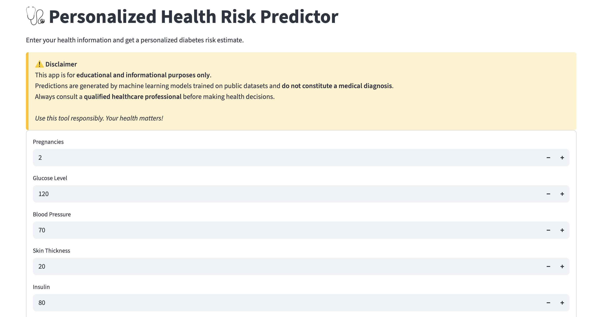
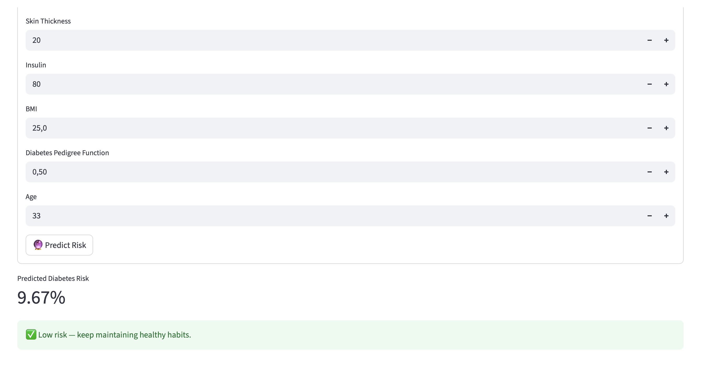

# 🩺 Personalized Health Risk Predictor

## Introduction

The **Personalized Health Risk Predictor** is an interactive AI-powered web application that estimates an individual’s **risk of developing diabetes** based on health indicators.  

It was designed as a **portfolio project** to demonstrate practical skills in **machine learning, data science, and web app development**.  

👉 **Try it live here:** [Streamlit App Deployment](https://personalizedhealthriskpredictor.streamlit.app/)  
👉 **Source code on GitHub:** [Repository Link](https://github.com/cersei568/personalized_health_risk_predictor)  

With a simple, clean interface, this app makes predictive modeling accessible: users input their health data and instantly see a risk score — backed by a trained ML model.  

⚠️ **Disclaimer:** This tool is for **educational purposes only** and does **not provide medical advice or diagnosis**. Always consult a healthcare professional for real medical guidance.

---

## Features

- **Interactive Input Form**  
  Enter health details like age, BMI, glucose, blood pressure, etc.  

- **Instant AI Predictions**  
  Risk estimates generated with a trained **Logistic Regression model** (on the Pima Indians Diabetes Dataset).  

- **Clear Visual Feedback**  
  Results displayed with **color-coded alerts** (low, medium, high risk).  

- **Educational Value**  
  Great for learning how ML models are trained, deployed, and used in real applications.  

---

## Screenshots

### User Input Form  

### Prediction Results  

---

## ⚙️ Tech Stack

- **Frontend / UI:** [Streamlit](https://streamlit.io/)  
- **Machine Learning:** [scikit-learn](https://scikit-learn.org/stable/)  
- **Data Handling:** Pandas, NumPy  
- **Model Persistence:** Joblib  
- **Styling:** Custom HTML/CSS injected into Streamlit  

---

## How It Works

1. **User inputs health data** (age, BMI, glucose, insulin, etc.).  
2. Data is fed into a **pre-trained ML pipeline** stored as `advanced_model.joblib`.  
3. The model outputs a **probability score** for diabetes risk.  
4. Streamlit displays the result using clear, color-coded feedback.  

---